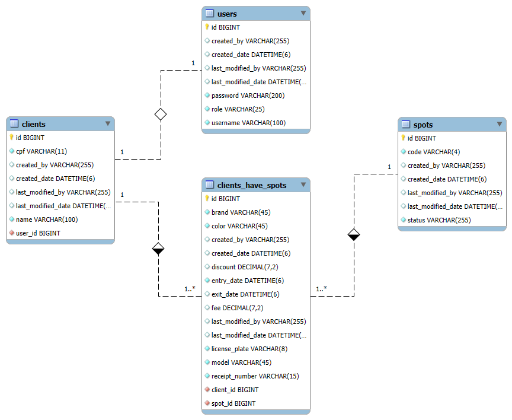

<h1 align="center">🚗 Parking API 🏁 </h1>

<h3 align="center">Um modelo de API para um estacionamento de veículos</h3>

<p align="center">
  
</p>

Nesse sistema é possível realizar consultas do cadastro de um cliente pelo seu id ou cpf, consultar vagas livres ou ocupadas, cadastrar novas vagas e verificar recibos de um cliente.

O login e o perfil são gerenciados pelo Spring Security, sendo 2 perfis possíveis: Administrador e Cliente, ambos autenticados por um token de sessão.

Todo cliente precisa ter um cadastro de usuário na API para realizar estacionamentos dos seus veículos. Após o cadastro de usuário, é necessário preencher um perfil de cliente com algumas outras informações. Entre elas, um nome e CPF. As tabelas Usuário (users) e Cliente (clients) têm relacionamento (1-1).

O Estacionamento tem uma série de vagas disponíveis para cadastro (Tabela spots), que armazena o seu código e status, para sabermos se ela está ocupada ou não.

Precisaremos dos dados do cliente e vaga que será ocupada para realizar os registros de estacionamentos, gerando assim uma tabela extra (clients_have_spots). Por isso as tabelas de Clientes e Vagas terão relacionamento N-N.
Essa tabela extra armazena características do veículo assim como hora de entrada e saída e custos para a geração de um recibo e até mesmo relatório dos estacionamentos realizados por um cliente.

<p align="center">
  
</p>

### ⚙️ Tecnologias Utilizadas 

<p align="left">
  
</p>

Linguagens, ferramentas e bibliotecas utilizadas para elaborar o projeto.

* [Java 17](https://www.oracle.com/java/technologies/javase/jdk17-archive-downloads.htmlo)
* [MySQL](https://www.mysql.com/)
* [Spring Boot 3](https://spring.io/tools)
* [JasperSoft Studio](https://community.jaspersoft.com/download-jaspersoft/community-edition/)
* [Postman](https://www.postman.com/downloads/)

## 🧩 Dependências e Versões Necessárias 

<p align="left">
  
</p>

* MySQL - Versão: 8.0.3
* JasperReports - Versão: 6.20.5
* Spring Security
* JUnit

##  🪄 Como rodar o projeto

<p align="left">
  
</p>

Com o apoio da sua IDE escolhida faça o download do projeto aqui no git, na opção: **<>code**.

Importe o projeto em:

```
File > Import > Existing Maven Project > [Pasta com projeto local] > pom.xml > finish
```

Na pasta do projeto encontre o caminho:

```
src/main/java/com/mballem/demoparkapi/DemoParkApiApplication.java
```

Depois, escolha as seguintes opções com o lado direito do cursor:

```
 > Run As > Java Application
```

É normal de cada IDE exibir um log mostrando da execução do comando, a aplicação terá iniciado quando a mensagem:
"Started DemoParkApiApplication in 6.029 seconds (process running for 6.578)" aparecer no console.

## 🔧 Construindo a base do projeto

<p align="left">
  
</p>

Junto com o projeto foram disponibilizados o script para criar e montar a base de dados utilizada no projeto e também a coleção do Postman com todos os cenários possíveis do sistema de estacionamentos.

Você pode encontrá-los na pasta **data** no caminho:
```
src/main/resources/data/ParkApi.postman_collection.json

src/main/resources/data/demo-park-script.sql
```

Basta importá-los nos seus respectivos programas. Para .sql utilize o MySQL e para o .json utilize o Postman.

Você pode encontrar o link para download dessas ferramentas na seção Tecnologias Utilizadas.

**Obs: Todos os dados inseridos nas bases são fictícios e gerados no [Gerador de CPFs](https://www.4devs.com.br/gerador_de_cpf)**

## 📊 Como rodar os testes

<p align="left">
  
</p>


Os testes foram executados com o apoio da integração de JUnit para a IDE do Spring Tools, dispensando o uso de linha de comando. 

Seguir o caminho:
```
src/test/java/com/mballem/demoparkapi > .class > Run As > JUnit Test
```

## ⚠️ Problemas enfrentados

<p align="left">
  
</p>

### Erro de Response XML no Postman:
Após inserir a dependência para o JasperReports no pom.xml as respostas no Postman para o recurso de autenticação retornavam a resposta em XML.
* **Como solucionar:** Inserir uma classe de configuração que implemente a WebMvcConfigurer ou definir na aplicação apenas o padrão JSON como resposta, usando o produces nas anotações dos recursos.

### Erro nos testes unitários:
Os testes não passavam por terem intervalos muito longos entre as datas de entrada e saída no script sql fornecido nos recursos do projeto.
* **Como solucionar:** Atualizar os scripts com novas datas de entrada e saída para os check-ins com intervalos não muito longos entre os registros.

## ⏭️ Próximos passos

<p align="left">
  
</p>

Futuramente, o projeto terá uma interface visual front-end.
